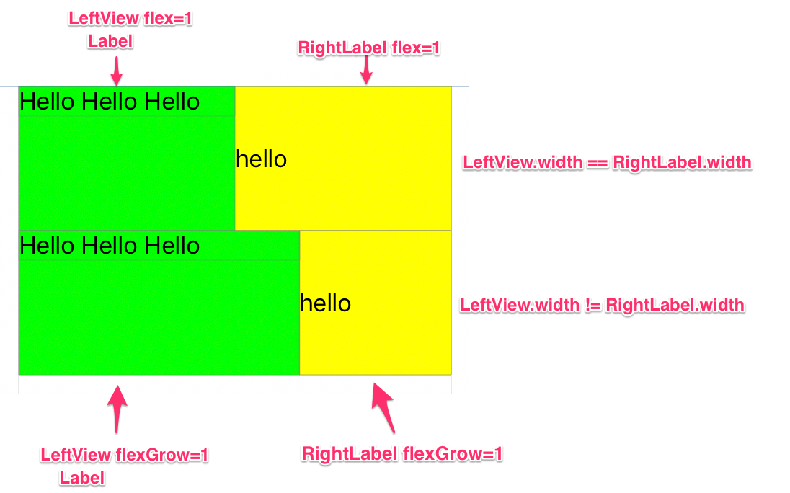

# TestYogaKit

In the demo, I setup the scene with the view hierarchy like this:

```
ContainerView
  ContainerView1 - flex=1
    Label
  Label1 - flex=1
ContainerView2
  ContainerView - flexGrow=1
    Label
  Label2 - flexGrow=1
```

I expect:
  - ContainerView1's width is equal to Label1's width ✅
  - ContainerView2's width is equal to Label2's width ❌


Below is the screenshot of the demo with explanation:

